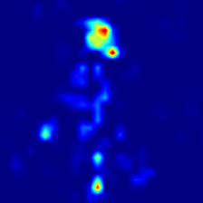
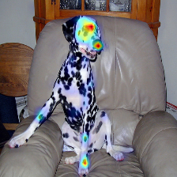
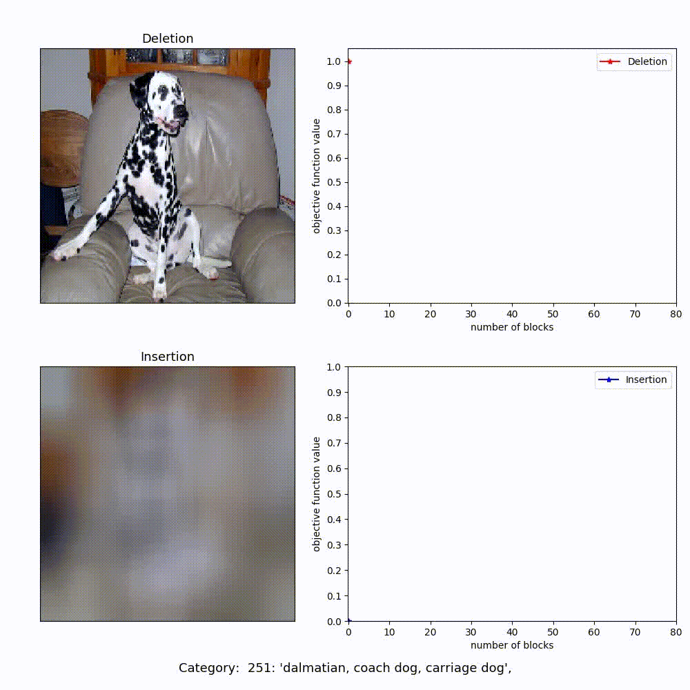

# IGOS
This is a simple pytorch demo of the Integrated-Gradients Optimized Saliency (I-GOS) described in
>**Visualizing Deep Networks by Optimizing with Integrated Gradients** ([PDF](https://arxiv.org/abs/1905.00954)) 
Zhongang Qi, Saeed Khorram, Fuxin Li, in arXiv preprint arXiv:1905.00954. 

For project website, please see: 
http://people.oregonstate.edu/~khorrams/igos_demo_no_gpu/#results

## Quick Start
**IGOS_generate_video.py**: utilize I-GOS to generate saliency maps for the images in **‘./Images/’** on the pretrained VGG19 networks for ImageNet from the PyTorch model zoo, and then write video for each image to demonstrate how the deletion and insertion curves change.  

Here are some example results:

Saliency maps:

  

Videos:

## Dependencies
All code is written in Python 3.6. You may need PyTorch 0.4.0 to make the code work well.   
